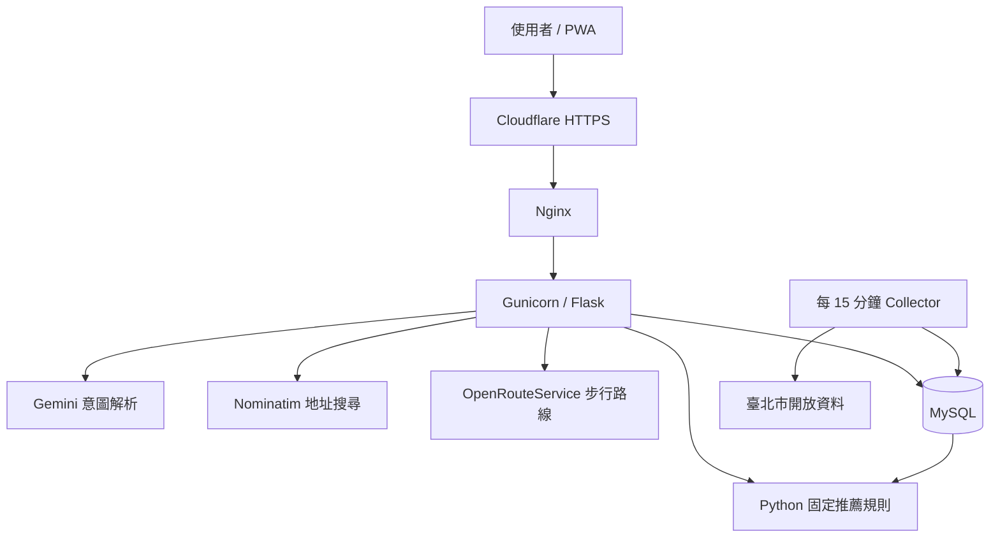

# 停車地獄雷達 🚗

整合臺北市即時停車資料、實際步行距離與可解釋規則，回答使用者最在意的問題：**「現在該停哪裡？」**

Gemini 只負責理解自然語言；停車場篩選、風險判斷與推薦排序皆由可測試的 Python 規則決定。

[Live Demo](https://aipe04.zebra-ai-gateway.com/) · [](https://github.com/hh123456tw/parking-radar/actions/workflows/ci.yml)


## 為什麼做這個專案？

一般停車場網站只告訴使用者「附近有哪些停車場」，但駕駛真正需要判斷的是：

- 哪些停車場現在還有機會？
- 最近的停車場是否已經快滿？
- 停好車後要走多久？
- 今天的費率、上限與場站型態是什麼？
- 官方或外部服務暫時失敗時，系統能否繼續使用？

停車地獄雷達把即時空位、步行距離、費率與歷史樣本整理成容易理解的圖卡，並清楚說明推薦原因。

## 核心功能

- 查詢臺北市路外停車場即時剩餘車位與總車位。
- 以地址、行政區、地標或自然語言搜尋目的地。
- 模糊搜尋最多提供三個候選地點，避免系統自行選錯目的地。
- 使用 OpenRouteService 計算停好車後的步行時間；失敗時退回直線距離。
- 先排除無效及高風險場站，再從可前往場站中優先選擇步行距離較近者。
- 顯示當日費率、停車上限、平假日與地下／平面／機械等場站資訊；無法可靠判斷時明確顯示未知。
- 圖卡可直接開啟 Google Maps 汽車導航，並可按需查看最近七天空位趨勢。
- 支援 iPhone Safari 與主畫面 PWA 的繁體中文語音輸入。
- 管理儀表板提供匿名使用分析與伺服器狀態；公開查詢不需要登入。

專案目前聚焦臺北市路外停車場，不包含 AI 空位預測、路邊車格、會員系統及個別民營業者爬蟲。

## 系統架構



### 查詢流程

```text
使用者輸入目的地
        ↓
Gemini 解析意圖，或使用手動查詢
        ↓
Nominatim 找出並驗證目的地座標
        ↓
MySQL 取得最新有效停車資料
        ↓
Python 套用固定風險規則
        ↓
OpenRouteService 補上步行時間
        ↓
前端顯示推薦圖卡、地圖與導航連結
```

## 核心工程決策

### 1. AI 只理解問題，不決定推薦

Gemini 負責將「我要去台北車站」等自然語言轉成結構化查詢。推薦結果仍由 Python 規則產生，因此可以重現、測試並說明原因；Gemini 無法使用時，手動查詢仍可正常運作。

### 2. 先判斷風險，再比較距離

系統先排除無效資料及高風險場站，再於安全場站中比較步行時間。這可避免「最近，但只剩一格」的停車場被排在第一名。

### 3. 官方特殊值不當成負車位

臺北市資料中的 `-9`、`-11`、`-12`、`-13` 代表特殊狀態，不是負的剩餘車位。清洗時會排除這些數值，避免地獄指數與排名失真。

### 4. 外部服務失敗時仍可查詢

- Gemini 失敗：退回手動查詢。
- Nominatim 找不到唯一地點：顯示候選地點供使用者選擇。
- OpenRouteService 失敗：退回直線距離並標示距離來源。
- 官方資料暫時無法更新：顯示最近一次有效資料與資料時間。

### 5. 地址與外部結果優先使用快取

地址座標與停車場中繼資料先從 MySQL 快取取得，降低首次以外查詢的等待時間，也減少對免費外部 API 的依賴。

### 6. 分析資料與管理介面分離

公開使用者不需要登入；管理介面由反向代理層的身份驗證保護。正式部署必須使用強隨機密碼或受控身份驗證服務，任何憑證皆不得提交至版本庫。

## 推薦規則摘要

- 排除無效資料及搜尋範圍外的場站。
- 剩餘不超過 3 格：不建議前往。
- 剩餘不超過 10 格，或空位率低於 10%：列為備選。
- 其他有效場站：列為可以前往。
- 可以前往的場站優先，再依實際步行時間由近到遠排列。
- 安全場站不足時才補入備選；高風險場站只顯示排除數量。

地獄指數的基本概念是「已使用車位占總車位的比例」。歷史資料只作為趨勢參考，不代表抵達時仍有相同空位。

## 技術組合

**Backend:** Python 3.13 · Flask · MySQL · Pandas

**AI & APIs:** Gemini · Nominatim · OpenRouteService · 臺北市開放資料

**Frontend:** Vanilla JavaScript · Leaflet · Chart.js · PWA

**Engineering:** Pytest · GitHub Actions · Gunicorn · Nginx · Cloudflare · GCP

## 自動測試與 CI

完整自動化測試套件涵蓋分析規則、API、資料收集、地址搜尋、步行路線、費率解析、PWA、Analytics 與管理儀表板。GitHub Actions 會在每次 push 與 pull request 執行離線測試。

```powershell
python -m pytest -q
node --check static/app.js
```

## Windows 快速啟動

需求：Python 3.11+、MySQL 8，以及可選的 Gemini、Nominatim 與 OpenRouteService 設定。

```powershell
python -m venv .venv
.\.venv\Scripts\Activate.ps1
python -m pip install -r requirements.txt
Copy-Item .env.example .env

mysql -u root -p -e "CREATE DATABASE parking_hell CHARACTER SET utf8mb4 COLLATE utf8mb4_unicode_ci;"
Get-Content -Raw schema.sql | mysql -u root -p parking_hell

python collector.py --once
flask --app app run --debug
```

開啟 <http://127.0.0.1:5000>。對話服務沒有設定金鑰時，網站會自動改用手動查詢。

## 主要環境變數

| 名稱 | 用途 |
|---|---|
| `MYSQL_HOST`、`MYSQL_PORT` | MySQL 連線位置 |
| `MYSQL_USER`、`MYSQL_PASSWORD`、`MYSQL_DATABASE` | 專案資料庫帳號與名稱 |
| `GEMINI_API_KEY`、`GEMINI_MODEL` | 自然語言意圖解析；留空時停用 |
| `NOMINATIM_USER_AGENT` | 地址搜尋服務識別資訊 |
| `OPENROUTESERVICE_API_KEY` | 實際步行路線；留空時改用直線距離 |
| `ANALYTICS_ENABLED` | 管理分析功能總開關 |
| `ANALYTICS_HMAC_SECRET` | 分析識別簽章秘密，只能存放於部署環境 |
| `DEPLOY_VERSION` | 管理儀表板顯示的部署版本 |

完整範例請參考 [.env.example](.env.example)，不要將 `.env` 或任何真實金鑰提交至版本庫。

## 資料來源與限制

- 停車資料來自臺北市政府開放資料，頁面會分別顯示官方資料時間與系統抓取時間。
- 地圖與地標資料使用 OpenStreetMap，OSM 標示保持可見。
- 官方費率為自由文字；系統只顯示能可靠解析的結果，原始費率仍保留供使用者查看。
- 系統無法可靠判斷費率或場站型態時會顯示未知，不以猜測值取代官方資訊。
- 路線、地標與生成式 AI 服務皆可能受免費額度、網路或供應商狀態影響。

## Documentation

- [Changelog](CHANGELOG.md)
- [QA Review](docs/QA_REVIEW_2026-08-21.md)
- [Analytics QA Review](docs/QA_REVIEW_2026-08-23_ANALYTICS.md)
- [Deployment Configurations](deploy/)
