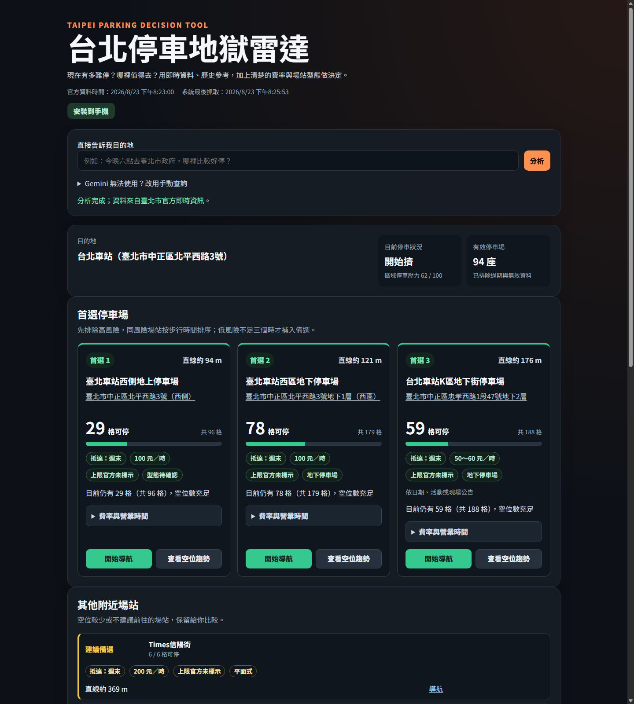
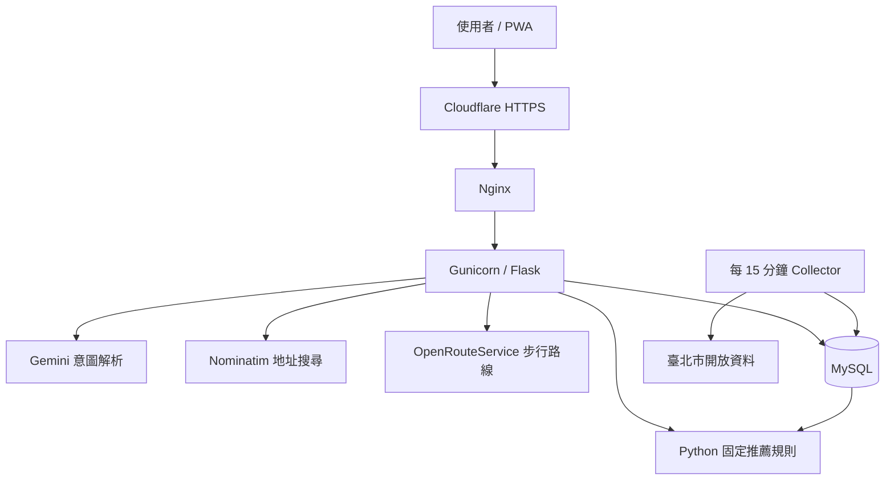

# 停車地獄雷達 🚗

整合臺北市即時停車資料、實際步行距離與可解釋規則，回答「現在該停哪裡？」Gemini 只解析自然語言，推薦結果由可測試的 Python 規則決定。

[Live Demo](https://aipe04.zebra-ai-gateway.com/) · [](https://github.com/hh123456tw/parking-radar/actions/workflows/ci.yml)



**Tech Stack:** Python 3.13 · Flask · MySQL · Pandas · Gemini · Leaflet · OpenRouteService · Pytest · Gunicorn · Nginx · GCP

## 功能範圍

- 臺北市路外停車場、地址 1.5 公里搜尋、三名推薦、避雷、平日／週末歷史參考。
- 地址模式可使用 OpenRouteService 顯示停好車後的實際步行時間；服務失敗時退回直線距離。
- 模糊地標可產生並驗證最多三個候選，使用者能在前端直接選擇。
- 單頁 Leaflet 地圖與一張最近七天折線圖。
- 結果圖卡可直接開啟 Google Maps 汽車導航；不含 AI 空位預測、路邊格位、會員及個別民營業者爬蟲。

重要行為變更整理於 [CHANGELOG.md](CHANGELOG.md)。

## 架構與工程決策



幾個關鍵工程決定：

- Gemini 只負責解析自然語言意圖；推薦、評分與警示全部由 Python 固定規則決定，結果可測試、可重現。
- 官方資料中的負數狀態值是特殊狀態（例如 `-9`、`-11`），不是負車位，不進入數值計算。
- 地址轉座標以 MySQL 快取優先，降低延遲並減少對外部地址服務的依賴。
- 資料過期時仍顯示最近一次有效快照並標示警告，不因暫時抓不到資料而阻斷查詢。
- 查詢紀錄只包含各階段耗時，不記錄目的地或座標。

## 自動測試與 CI

截至 2026-08-24 共 **298 項自動測試**（`pytest` 全數通過），涵蓋分析、路由、收集器、費用、行事曆、PWA、管理儀表板與 CI 合約；GitHub Actions 於每次 push／pull request 執行完整離線測試（見 [.github/workflows/ci.yml](.github/workflows/ci.yml)）。

## Windows 本機啟動

```powershell
python -m venv .venv
.\.venv\Scripts\Activate.ps1
python -m pip install -r requirements.txt
Copy-Item .env.example .env
mysql -u root -p -e "CREATE DATABASE parking_hell CHARACTER SET utf8mb4 COLLATE utf8mb4_unicode_ci;"
Get-Content -Raw schema.sql | mysql -u root -p parking_hell
python collector.py --once
python -m pytest -q
flask --app app run --debug
```

若要在 Windows 每 15 分鐘自動收集一次，可於 PowerShell 以系統管理員註冊工作排程器：

```powershell
$projectRoot = (Resolve-Path .).Path
$action = New-ScheduledTaskAction `
  -Execute "$projectRoot\.venv\Scripts\python.exe" `
  -Argument "collector.py --once" `
  -WorkingDirectory $projectRoot
$trigger = New-ScheduledTaskTrigger `
  -Once -At (Get-Date).AddMinutes(1) `
  -RepetitionInterval (New-TimeSpan -Minutes 15)
Register-ScheduledTask `
  -TaskName "ParkingRadarCollector" `
  -Action $action -Trigger $trigger `
  -Description "每 15 分鐘收集臺北市停車快照"
```

## 環境變數

| 名稱 | 用途 |
|---|---|
| `FLASK_SECRET_KEY` | Flask session 簽章；部署時必須換成長隨機字串 |
| `MYSQL_HOST` / `MYSQL_PORT` | MySQL 位址，部署時固定 localhost:3306 |
| `MYSQL_USER` / `MYSQL_PASSWORD` / `MYSQL_DATABASE` | 專題資料庫帳號與名稱 |
| `GEMINI_API_KEY` | 留空時停用對話並使用手動表單 |
| `GEMINI_MODEL` | 預設 `gemini-3.5-flash-lite` |
| `NOMINATIM_USER_AGENT` | 必須包含可辨識的專題名稱與聯絡資訊 |
| `OPENROUTESERVICE_API_KEY` | 免費步行路線 Matrix API 金鑰；留空時沿用直線距離 |
| `ANALYTICS_ENABLED` | 匿名分析總開關；`1`（預設）啟用、`0` 停用。停用時事件端點一律 204 且不寫入，無需重啟即可套用 |
| `ANALYTICS_HMAC_SECRET` | 匿名分析 HMAC 簽章秘密；部署時以 `openssl rand -hex 32` 產生，只放在 VM |
| `DEPLOY_VERSION` | 管理儀表板顯示的部署版本識別（例如 Git commit 短碼） |

對話只說目的地而未指定抵達時間時，系統會自動使用 `Asia/Taipei` 的目前時間。

## 計算與資料清洗

- 停車場地獄指數：`(總車位 - 剩餘車位) / 總車位 × 100`。
- 行政區地獄指數：`全區已使用有效車位 / 全區有效總車位 × 100`。
- 有歷史樣本：即時容易度 50% + 距離容易度 30% + 歷史容易度 20%。
- 歷史不足：即時容易度 60% + 距離容易度 40%。
- `-9`、`-11`、`-12`、`-13` 是官方特殊狀態，不是負車位，不進入數值計算。
- 歷史分析為過去樣本參考，不代表抵達時仍有相同空位。
- 圖卡的推薦、警示、避雷與白話原因全部由 Python 固定規則產生；Gemini 只解析對話條件。
- 停車場地址與 Google 地圖連結使用既有座標或地址，不使用付費 Google Maps API。
- 推薦先依空位規則分級，再於同風險場站中比較步行時間。為控制速度，每次最多查詢 15 座，路線名額優先給低風險且直線較近的場站；OpenRouteService 失敗或沒有金鑰時，會退回直線距離排序並明確標示。
- 頁面分開顯示官方動態資料時間與本系統抓取時間，避免誤判資料新鮮度。

## GCP 1 vCPU／1 GB 部署

正式網站（https://aipe04.zebra-ai-gateway.com/）由 Cloudflare 提供 HTTPS；下列為通用自架部署指引。

1. 建立 Ubuntu VM，執行 `sudo fallocate -l 2G /swapfile && sudo chmod 600 /swapfile && sudo mkswap /swapfile && sudo swapon /swapfile`，並在 `/etc/fstab` 加入 `/swapfile none swap sw 0 0`。
2. 安裝 Python、MySQL、Nginx，建立 `parking` 系統使用者，專案放在 `/opt/parking-hell` 並由該使用者擁有。
3. 在 MySQL 設定加入：`bind-address=127.0.0.1`、`innodb_buffer_pool_size=128M`、`max_connections=30`、`performance_schema=OFF`，重新啟動後確認 3306 未對外開放。
4. 建立 `.venv` 與不進 Git 的 `.env`，執行 schema 與第一次 collector。
   若要顯示實際步行時間，在 `.env` 加入 `OPENROUTESERVICE_API_KEY=你的金鑰`。
5. 安裝 `deploy/parking-radar.service` 與 `deploy/nginx-parking-radar.conf`；其中 nginx 必須為 `location /static/` 加上 `Service-Worker-Allowed: /` 回應標頭，否則 PWA 服務工人無法以 `/` 範圍註冊（見下方「部署補充」）。
6. 以 `systemctl enable --now parking-radar nginx` 啟動。
7. 以 `parking` 使用者執行 `crontab -e` 加入：

```cron
*/15 * * * * cd /opt/parking-hell && /opt/parking-hell/.venv/bin/python collector.py --once >> /opt/parking-hell/collector.log 2>&1
```

### 部署補充：行事曆、費率與設施中繼資料

首次部署或升級既有部署時，依序完成以下步驟：

1. 備份 `parking_lots`：
   `mysqldump -u parking -p parking_hell parking_lots > parking_lots.backup.sql`
2. 套用中繼資料遷移（重複執行安全）：
   `mysql -u parking -p parking_hell < migrations/20260819_add_parking_metadata.sql`
3. 收集一次資料：
   `/opt/parking-hell/.venv/bin/python collector.py --once`
4. 下載行事曆：
   `/opt/parking-hell/.venv/bin/python calendar_service.py --sync`
5. 同步費用與設施型態：
   `/opt/parking-hell/.venv/bin/python parking_metadata.py --sync`
6. 安裝並啟用每月維護計時器：
   `sudo install -m 644 deploy/parking-metadata-refresh.service deploy/parking-metadata-refresh.timer /etc/systemd/system/`
   `sudo systemctl daemon-reload && sudo systemctl enable --now parking-metadata-refresh.timer`
7. 重啟 Gunicorn 並確認健康檢查：
   `sudo systemctl restart parking-radar && curl -fsS http://127.0.0.1:8000/health`
8. 查詢「台北車站」，確認主要與精簡卡片、地圖與七天歷史行為皆正常。
9. 安裝 PWA：Android Chrome 使用「安裝應用程式」；iOS Safari 使用「加入主畫面」（需 HTTPS，見下方「PWA 需 HTTPS」說明）。

計時器於每月執行一次（`OnCalendar=monthly`），補行錯過批次（`Persistent=true`），並附加一小時隨機延遲
（`RandomizedDelaySec=1h`），避免與資料來源尖峰重疊。維護任務是獨立的 `Type=oneshot` 單位，其成敗不會重啟或停止 `parking-radar.service`。

### 部署補充：分析儀表板管理端保護與清理

管理儀表板（`/admin/` 下所有 HTML 與 API）由 Nginx Basic Auth 保護；公開使用者不需登入，
Flask 不新增任何帳號機制。密碼雜湊與 `ANALYTICS_HMAC_SECRET` 只存在 VM 上，一律不進入 Git。

地點類型（`place_type`）診斷目前暫緩：沒有可靠的允許清單來源，系統不會從自由文字推斷類別；
事件欄位與彙整輸出保留為可空以維持向後相容，待有允許清單來源後再啟用。

順序重點：先套用遷移建立 `analytics_events`，再重啟 Gunicorn 載入分析程式碼，
最後才重載 Nginx 對外暴露 `/admin/`。htpasswd 與 Nginx 設定檔可先準備，
但不要在資料表存在前啟動分析程式碼或重載 Nginx。

1. 產生 HMAC 秘密並寫入 `.env`（只在 VM 上執行）：
   `openssl rand -hex 32`
   把輸出貼到 `/opt/parking-hell/.env` 的 `ANALYTICS_HMAC_SECRET=` 之後。
2. 安裝 `apache2-utils` 並建立管理帳密檔：
   `sudo apt install -y apache2-utils`
   `sudo htpasswd -c /etc/nginx/.htpasswd-parking-radar admin`
3. 更新 `deploy/nginx-parking-radar.conf`（沿用既有安裝方式覆蓋站台設定），並安裝日誌格式／限流設定：
   `sudo install -m 644 deploy/nginx-parking-radar-log-format.conf /etc/nginx/conf.d/`
4. 套用分析事件遷移（重複執行安全）：
   `mysql -u parking -p parking_hell < migrations/20260823_add_analytics_events.sql`
5. 重啟 Gunicorn 讓分析程式碼在資料表存在後載入，並確認健康檢查：
   `sudo systemctl restart parking-radar && curl -fsS http://127.0.0.1:8000/health`
6. 測試並重載 Nginx：
   `sudo nginx -t && sudo systemctl reload nginx`
7. 以 `parking` 使用者加入每日清理 cron：
   `17 3 * * * cd /opt/parking-hell && /opt/parking-hell/.venv/bin/python analytics_cleanup.py >> /opt/parking-hell/analytics-cleanup.log 2>&1`
8. 驗證：
   - `curl -i http://127.0.0.1/admin/analytics` 未帶密碼時回傳 401；帶密碼時回傳 200 且回應含 `Cache-Control: no-store`。
   - `sudo tail -f /var/log/nginx/parking-radar.access.log` 每行只含時間、方法＋路徑、協定、狀態、回應位元組與處理時間，不含 IP。
   - 儀表板顯示 `.env` 的 `DEPLOY_VERSION`，且分析功能為啟用狀態。

#### 回滾

- Nginx：還原先前的 `nginx-parking-radar.conf`，移除 `/etc/nginx/conf.d/nginx-parking-radar-log-format.conf`，再執行 `sudo nginx -t && sudo systemctl reload nginx`。
- Cron：只移除 analytics cleanup 那一行，其餘（collector 等）全部保留。
- 應用程式：切回前一個部署 commit 後以 `sudo systemctl restart parking-radar` 重啟。
- 資料：保留 `analytics_events` 表與既有事件；除非擁有者明確決定刪除，否則不執行 DROP。

PWA 離線外殼需要 nginx 對 `sw.js` 回應 `Service-Worker-Allowed: /`。前端以 `scope: "/"` 註冊（見 `static/app.js`），若 nginx 未在 `location /static/` 傳回該標頭，瀏覽器會拒絕超出
`/static/` 的範圍，服務工人便無法控制並離線快取整站。`deploy/nginx-parking-radar.conf` 對應區塊需為：

```nginx
location /static/ {
    alias /opt/parking-hell/static/;
    expires 1h;
    add_header Service-Worker-Allowed /;
}
```

**PWA 需 HTTPS**：Service Worker 只在「安全來源」（secure context）可用。以純 HTTP 存取部署網址時，
`navigator.serviceWorker` 不存在，`/static/sw.js` 無法註冊，離線外殼與「加入主畫面」安裝提示都不會出現；
本範例設定只監聽 `listen 80`。若要讓手機安裝此 PWA，請為網域申請憑證並讓 nginx 以 HTTPS 提供（例如先把
`server_name` 改為你的網域，再用 `certbot --nginx` 取得並自動套用 Let's Encrypt 憑證，或手動將
`deploy/nginx-parking-radar.conf` 改為 `listen 443 ssl` 並設定 `ssl_certificate` 與
`ssl_certificate_key`）。本機自用時，`http://localhost` 本身即為安全來源，可直接啟用安裝功能而不需 HTTPS。

### 資料來源與授權

- 官方停車資料依臺北市開放資料授權，可商業再利用，但須標示資料來源為臺北市政府。
- 地圖與地標資料使用 OpenStreetMap；OSM 標示在頁面保持可見。
- 系統無法判斷時以明確「未知」標籤呈現，不代表實際收費或設施型態的保證。
- 本系統不含會員帳號，也不儲存個人目的地歷史；所有查詢一律匿名。

## 展示檢查

1. 手動選行政區可完成查詢。
2. 輸入臺北市地址可顯示 1.5 公里候選、最近與前三名推薦。
3. Gemini 可處理推薦、歷史、平週末比較及一次簡單追問。
4. 關閉 Gemini 金鑰後，頁面會引導手動查詢。
5. Nominatim 查不到地址時，可退回行政區查詢。
6. 地圖、唯一折線圖、資料時間與 OpenStreetMap 標示皆可見。
