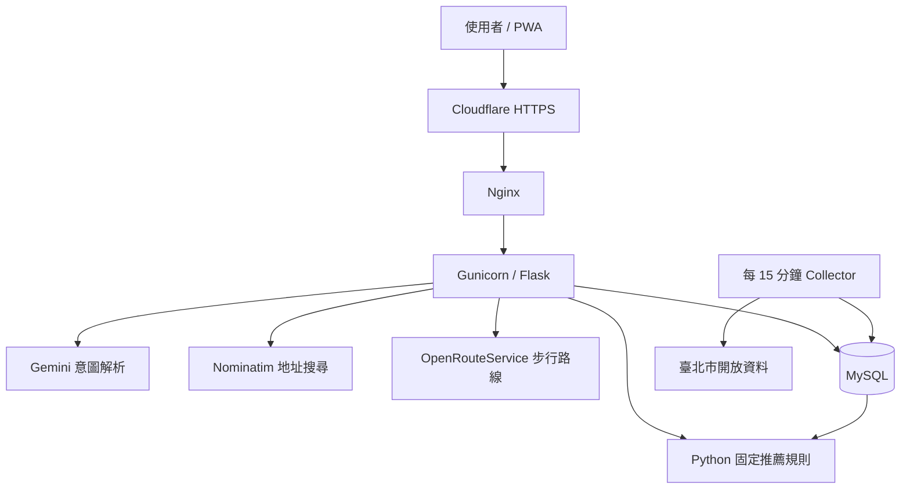

# Parking Radar Portfolio Readiness Implementation Plan

> **For agentic workers:** REQUIRED SUB-SKILL: Use superpowers:subagent-driven-development (recommended) or superpowers:executing-plans to implement this plan task-by-task. Steps use checkbox (`- [ ]`) syntax for tracking.

**Goal:** 同步公開主分支，加入 CI 與作品集 README，並讓所有停車場 Google Maps 操作直接進入行車導航。

**Architecture:** 保留現有 Flask、MySQL、PWA 與 GCP 架構。前端只替換 Google Maps URL 產生規則並更新 Service Worker cache key；CI 與 README 都是 repo 外圍改善，不改 API、資料庫或推薦演算法。

**Tech Stack:** Python 3.13、Flask、pytest、JavaScript、GitHub Actions、Mermaid、Google Maps URLs、GCP systemd/nginx

**Spec:** `docs/superpowers/specs/2026-08-23-portfolio-readiness-design.md`

## Global Constraints

- 不新增 Python 或 JavaScript runtime dependency。
- 不修改推薦公式、API response、資料庫 schema 或 Gemini contract。
- CI 不得連線正式 MySQL、Gemini、Nominatim、OpenRouteService 或臺北市 API。
- README 不得放 API key、VM IP、資料庫密碼或目的地查詢紀錄。
- 使用者原有的 `.tmp/`、`output/` 與其他未追蹤計畫檔不得加入 commit。
- 每個程式變更保留淺顯的繁體中文註解。

---

### Task 1: 同步主分支並建立隔離分支

**Files:**
- No file changes

**Interfaces:**
- Consumes: 本機 `master` commit `e528df2`
- Produces: 與正式站一致的 `origin/master`，以及 `codex/portfolio-readiness` 工作分支

- [ ] **Step 1: 確認只存在使用者的未追蹤檔案**

Run:

```powershell
git status --short
git log -3 --oneline --decorate
```

Expected: tracked files clean；`.tmp/`、`output/` 與兩份既有未追蹤 plan 保持未追蹤。

- [ ] **Step 2: 重新驗證即將推送的主分支**

Run:

```powershell
.\.venv\Scripts\python.exe -m pytest -q
.\.venv\Scripts\python.exe -m py_compile app.py config.py geocoder.py
node --check static/app.js
node --check static/sw.js
```

Expected: 198 tests pass；其他命令 exit 0。

- [ ] **Step 3: 推送主分支並建立功能分支**

Run:

```powershell
git push origin master
git switch -c codex/portfolio-readiness
```

Expected: `origin/master` 指向 `e528df2`，目前分支為 `codex/portfolio-readiness`。

---

### Task 2: Google Maps 直接導航

**Files:**
- Modify: `tests/test_frontend_contract.py`
- Modify: `tests/test_pwa_contract.py`
- Modify: `static/app.js:194-203`
- Modify: `static/sw.js:1-7`
- Modify: `templates/index.html:8-9`

**Interfaces:**
- Consumes: `lot.latitude`, `lot.longitude`, `lot.lot_name`, `lot.address`, `lot.district`
- Produces: `googleMapsUrl(lot) -> string | null`，Google Maps Directions URL

- [ ] **Step 1: 將前端契約改成導航網址**

Update `tests/test_frontend_contract.py` so the card contract requires:

```python
assert "https://www.google.com/maps/dir/?api=1&travelmode=driving&destination=" in script
assert "https://www.google.com/maps/search/?api=1&query=" not in script
assert "開始導航" in script
```

Update `tests/test_pwa_contract.py` to require cache version `navigation-v1`:

```python
assert "parking-radar-shell-navigation-v1" in sw
assert "style.css?v=navigation-v1" in sw
assert "app.js?v=navigation-v1" in sw
```

- [ ] **Step 2: 執行契約測試並確認先失敗**

Run:

```powershell
.\.venv\Scripts\python.exe -m pytest tests/test_frontend_contract.py tests/test_pwa_contract.py -q
```

Expected: FAIL because the current implementation still uses `maps/search` and `walking-v1`.

- [ ] **Step 3: 實作最小導航 URL**

Replace `googleMapsUrl` in `static/app.js` with this behavior:

```javascript
function googleMapsUrl(lot) {
  const base = "https://www.google.com/maps/dir/?api=1&travelmode=driving&destination=";
  if (lot.latitude != null && lot.longitude != null) {
    return `${base}${encodeURIComponent(`${lot.latitude},${lot.longitude}`)}`;
  }
  const address = formatFullAddress(lot);
  if (address === "地址資料未提供" && !lot.lot_name) return null;
  return `${base}${encodeURIComponent(`${lot.lot_name || ""} ${address}`.trim())}`;
}
```

Change primary CTA text from `開啟 Google 地圖` to `開始導航` and compact action text from `Google 地圖` to `導航`.

Change all `walking-v1` shell versions in `static/sw.js`, `templates/index.html` and matching tests to `navigation-v1`; set:

```javascript
const CACHE_NAME = "parking-radar-shell-navigation-v1";
```

- [ ] **Step 4: 執行前端與 PWA 契約測試**

Run:

```powershell
.\.venv\Scripts\python.exe -m pytest tests/test_frontend_contract.py tests/test_pwa_contract.py -q
node --check static/app.js
node --check static/sw.js
```

Expected: all tests pass；兩個 Node commands exit 0。

- [ ] **Step 5: Commit**

```powershell
git add tests/test_frontend_contract.py tests/test_pwa_contract.py static/app.js static/sw.js templates/index.html
git commit -m "feat: open parking lots in Google Maps navigation"
```

---

### Task 3: GitHub Actions CI

**Files:**
- Create: `.github/workflows/ci.yml`
- Create: `tests/test_ci_contract.py`

**Interfaces:**
- Consumes: `requirements.txt`, `tests/`, `static/app.js`, `static/sw.js`
- Produces: GitHub Actions workflow named `CI`

- [ ] **Step 1: 新增失敗的 CI contract test**

Create `tests/test_ci_contract.py`:

```python
"""CI contract：每次 push/PR 必須執行後端與前端核心檢查。"""

from pathlib import Path


WORKFLOW = Path(__file__).parents[1] / ".github" / "workflows" / "ci.yml"


def test_ci_runs_required_offline_checks():
    text = WORKFLOW.read_text(encoding="utf-8")
    for required in (
        "push:", "pull_request:", "python-version: \"3.13\"",
        "node-version: \"22\"", "python -m pytest -q",
        "python -m compileall -q", "node --check static/app.js",
        "node --check static/sw.js",
    ):
        assert required in text
```

- [ ] **Step 2: 執行測試並確認 workflow 尚不存在**

Run:

```powershell
.\.venv\Scripts\python.exe -m pytest tests/test_ci_contract.py -q
```

Expected: FAIL with `FileNotFoundError` for `.github/workflows/ci.yml`.

- [ ] **Step 3: 建立最小 CI workflow**

Create `.github/workflows/ci.yml`:

```yaml
name: CI

on:
  push:
  pull_request:

permissions:
  contents: read

jobs:
  test:
    runs-on: ubuntu-latest
    timeout-minutes: 10
    steps:
      - uses: actions/checkout@v4
      - uses: actions/setup-python@v5
        with:
          python-version: "3.13"
          cache: pip
      - uses: actions/setup-node@v4
        with:
          node-version: "22"
      - name: Install Python dependencies
        run: python -m pip install -r requirements.txt
      - name: Run Python tests
        run: python -m pytest -q
      - name: Compile Python
        run: python -m compileall -q app.py ai_service.py analysis.py calendar_service.py collector.py config.py database.py fee_service.py geocoder.py parking_metadata.py walking_service.py tests
      - name: Check JavaScript syntax
        run: |
          node --check static/app.js
          node --check static/sw.js
```

- [ ] **Step 4: 驗證 CI contract 與完整測試**

Run:

```powershell
.\.venv\Scripts\python.exe -m pytest tests/test_ci_contract.py -q
.\.venv\Scripts\python.exe -m pytest -q
```

Expected: all tests pass。

- [ ] **Step 5: Commit**

```powershell
git add .github/workflows/ci.yml tests/test_ci_contract.py
git commit -m "ci: run tests on pushes and pull requests"
```

---

### Task 4: README 作品集首頁與架構圖

**Files:**
- Modify: `README.md`
- Create: `docs/images/parking-radar-demo.png`

**Interfaces:**
- Consumes: local candidate build and current architecture
- Produces: GitHub portfolio landing page with demo, screenshot, CI badge and Mermaid diagram

- [ ] **Step 1: 取得不含個資的正式畫面**

Run the candidate build locally, query `台北車站`, keep only public parking results, and capture a desktop screenshot to:

```text
docs/images/parking-radar-demo.png
```

The screenshot must not show API keys, browser account data, terminal output or unrelated tabs.

- [ ] **Step 2: 重寫 README 第一屏**

Place this information before installation instructions:

```markdown
# 停車地獄雷達 🚗

整合臺北市即時停車資料、實際步行距離與可解釋規則，回答「現在該停哪裡？」Gemini 只解析自然語言，推薦結果由可測試的 Python 規則決定。

[Live Demo](https://aipe04.zebra-ai-gateway.com/) · [](https://github.com/hh123456tw/parking-radar/actions/workflows/ci.yml)


**Tech Stack:** Python 3.13 · Flask · MySQL · Pandas · Gemini · Leaflet · OpenRouteService · Pytest · Gunicorn · Nginx · GCP
```

- [ ] **Step 3: 加入架構與工程決策**

Add this Mermaid diagram after the feature summary:



Document these decisions in plain language:

- Gemini only parses intent; Python decides recommendations.
- Official negative status values are excluded from numeric calculations.
- Geocoding uses MySQL cache to reduce latency and external dependency.
- Stale snapshots are shown with a warning instead of blocking the query.
- Query logs contain stage durations but not destinations or coordinates.

- [ ] **Step 4: 修正已過時文字並保留 runbook**

Make these exact corrections:

- Replace `不含導航` with a statement that cards open Google Maps driving navigation.
- State that the live domain is HTTPS through Cloudflare; keep the nginx/HTTPS section as a generic self-deployment note.
- State the actual count produced by Task 3（expected `199 項自動測試，截至 2026-08-23`）；若執行結果不同，以真實 pytest output 為準。
- Remove any statement saying the live site is still an old version.
- Keep Windows, GCP, MySQL, systemd, cron and metadata migration instructions after the portfolio sections.

- [ ] **Step 5: 驗證 README**

Run:

```powershell
rg -n "Live Demo|parking-radar-demo.png|flowchart TD|GitHub Actions|Google Maps|Cloudflare|自動測試" README.md
git diff --check
```

Open the README preview and verify the Mermaid diagram, screenshot, badge and links render without horizontal overflow.

- [ ] **Step 6: Commit**

```powershell
git add README.md docs/images/parking-radar-demo.png
git commit -m "docs: present parking radar as a portfolio project"
```

---

### Task 5: Review、CI、部署與正式站驗收

**Files:**
- No planned source changes; bug fixes discovered by QA require their own failing regression test and commit

**Interfaces:**
- Consumes: Tasks 2-4 commits
- Produces: reviewed branch, green GitHub Actions, recoverable production deployment

- [ ] **Step 1: 執行本機完整驗證**

Run:

```powershell
.\.venv\Scripts\python.exe -m pytest -q
.\.venv\Scripts\python.exe -m compileall -q app.py ai_service.py analysis.py calendar_service.py collector.py config.py database.py fee_service.py geocoder.py parking_metadata.py walking_service.py tests
node --check static/app.js
node --check static/sw.js
git diff --check
git status --short
```

Expected: all tests pass；tracked tree clean；使用者未追蹤檔仍未 staged。

- [ ] **Step 2: 進行獨立 code review**

Review the branch against `master` for:

- navigation URL correctness and encoding;
- PWA cache invalidation;
- CI least privilege and absence of secrets/external dependencies;
- README accuracy against the real code and deployment;
- accidental inclusion of `.tmp/`, `output/` or local secrets.

Fix Critical and Important findings before continuing.

- [ ] **Step 3: 推送功能分支並等待 CI**

Run:

```powershell
git push -u origin codex/portfolio-readiness
```

Expected: GitHub Actions `CI` completes successfully. Do not merge while CI is red.

- [ ] **Step 4: 依 finishing-a-development-branch 流程整合**

Offer the required merge/PR/keep choices. After the user authorizes integration, merge to `master`, rerun the full verification commands, and push `origin/master` only if the chosen option includes pushing.

- [ ] **Step 5: 建立可還原部署並切換**

Before deployment:

- verify `/opt/parking-hell` resolves to the expected application directory;
- record the deployed commit;
- preserve `.env` and the existing `.venv`;
- create a timestamped `/opt/parking-hell.rollback-<UTC timestamp>`;
- run the full pytest suite in the release directory before switching;
- automatically restore the rollback directory if service start or `/health` fails.

- [ ] **Step 6: 正式站驗收**

Verify:

```text
GET /health → 200 {"status":"ok"}
手動「台北車站」→ 正確目的地與停車場結果
聊天「我要去台北車站」→ 正確目的地，Gemini 失敗時仍可手動查詢
首選與精簡場站 → href 使用 /maps/dir/ 且 destination 正確
390 × 844 mobile → 卡片、地圖、導航按鈕無溢位
重新載入 PWA → navigation-v1 shell 生效
journalctl → 無新增 WARNING/ERROR，query_complete 不含目的地
```

- [ ] **Step 7: 記錄部署結果**

Update the project QA record with commit, test count, CI result, deployment timestamp, rollback path and live verification. Do not add new product features during this step.
